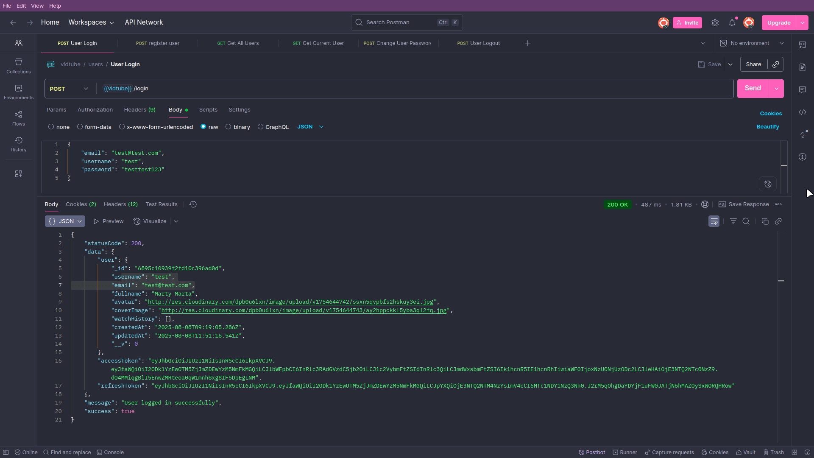
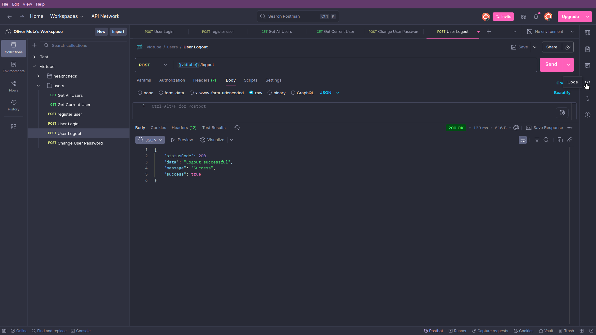
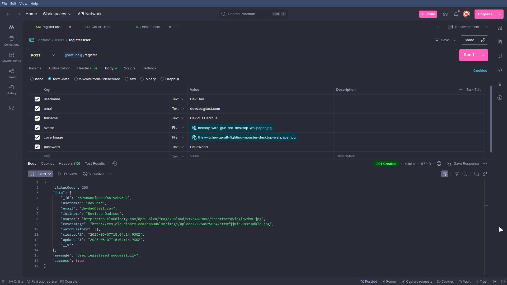
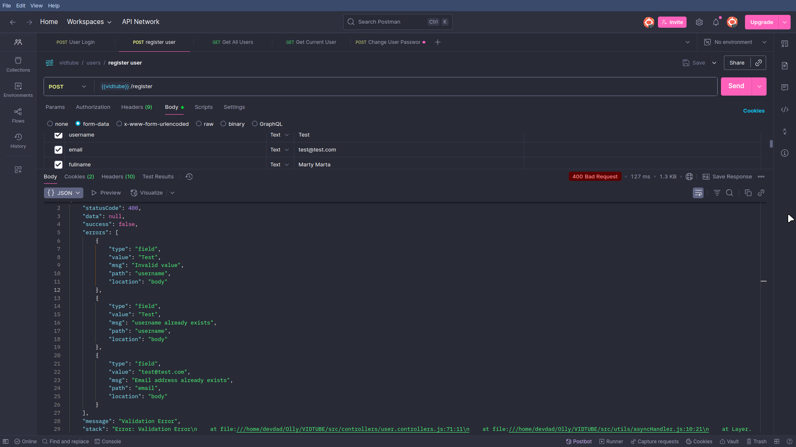
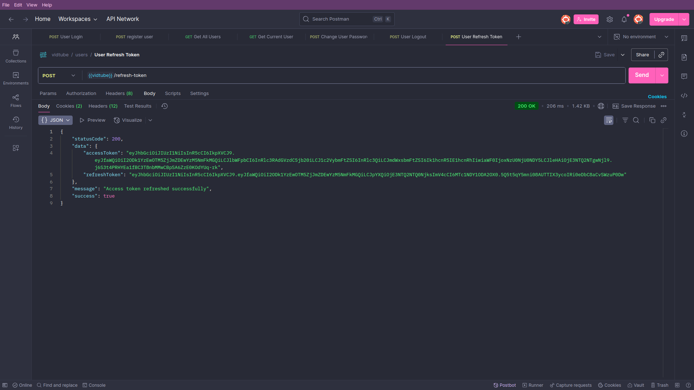
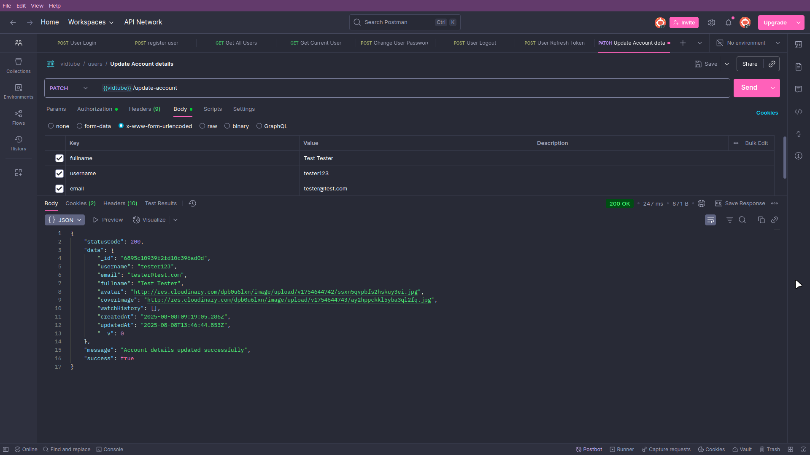

# VIDTUBE 🎥

_A lightweight YouTube-style backend API built with Node.js, Express, and MongoDB._


---

## 📦 About the Project

**VIDTUBE** is a backend REST API designed to simulate core functionalities of a video sharing platform like YouTube. It provides robust features for user registration, authentication, video uploads, profile management, and error handling - all while following MVC architecture and RESTful principles.

---

## 🚀 Tech Stack

- **Node.js** & **Express.js** - Web server and routing
- **MongoDB** & **Mongoose** - NoSQL database and ODM
- **Multer** - File uploads (avatars, profile pictures) to Cloudinary
- **Postman** - API testing and documentation

---


https://github.com/user-attachments/assets/fcad586c-6924-46a8-b212-2afe662e1f96


https://github.com/user-attachments/assets/7c0b4165-267d-49de-9f1f-178975ef4e75


<details>

<summary>🌟 User Routes</summary>








</details>

## 🔐 Core Features

- ✅ **User Authentication** (JWT-based)
- ✅ **Video Uploads** (Metadata only, no actual video streaming)
- ✅ **User Profile Management**
- ✅ **Avatar/Profile Image Upload** (via Multer then uploaded to Cloudinary)
- ✅ **Error Handling & Logging** (Custom Error middleware)
- ✅ **RESTful API Design**
- ✅ **API Testing via Postman**

---

## 🧪 Running Locally

### 1. Clone the Repo

```bash
git clone https://github.com/DevDad-Main/VIDTUBE.git
cd VIDTUBE
```

### 2. Install Dependencies

```bash
npm install
```

### 3. Create a `.env` File

```env
PORT=3000

MONGODB_URL=

ACCESS_TOKEN_SECRET=
ACCESS_TOKEN_EXPIRY="1hr"

REFRESH_TOKEN_SECRET=
REFRESH_TOKEN_EXPIRY="1hr"

CORS_ORIGIN="http://localhost:5173"

NODE_ENV="development"

CLOUDINARY_CLOUD_NAME=
CLOUDINARY_API_KEY=
CLOUDINARY_API_SECRET=
```

### 4. Start the Server

```bash
npm run dev
```

> The API will be live at `http://localhost:5173` -> Ready for the Frontend

---

6 Example API Endpoints

| Method | Endpoint                       | Description                 |
| ------ | ------------------------------ | --------------------------- |
| POST   | `/api/v1/users/register`       | Register a new user         |
| POST   | `/api/v1/users/login`          | Login and get token         |
| GET    | `/api/v1/users/:id`            | Get user profile            |
| PUT    | `/api/v1/users/update-account` | Update profile & avatar     |
| POST   | `/api/v1/users/new-video`      | Upload a new video metadata |
| GET    | `/api/v1/users/videos`         | Get all videos              |

---

## 🛠️ Error Handling

- Custom middleware catches unhandled routes and errors.

---

## 📤 File Uploads

- User avatars and profile pictures are uploaded via **Multer**.
- Files are stored in the Cloudinary Database with unique filenames.

---

## 🧑‍💻 Author

**Olly** - Aspiring _Backend Developer_  
📨 [softwaredevdad@gmail.com]

---

## 🪪 License

This project is open-source and available under the [MIT License](LICENSE).

---
